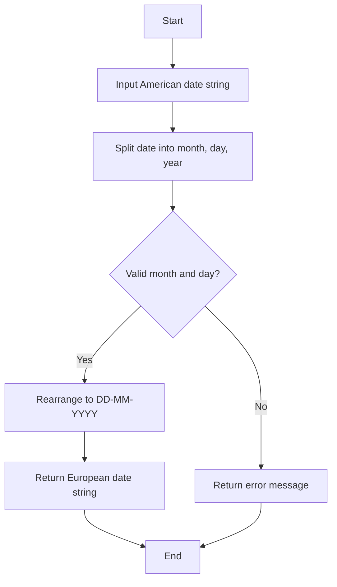

### 8 Project: Renaming Files with American-Style  Dates to European-Style Dates:-

```mermaid

flowchart TD
    A[Start] --> B[Input American date string]
    B --> C[Split date into month, day, year]
    C --> D{Valid month and day?}
    D -- Yes --> E[Rearrange to DD-MM-YYYY]
    E --> F[Return European date string]
    D -- No --> G[Return error message]
    F --> H[End]
    G --> H


```

