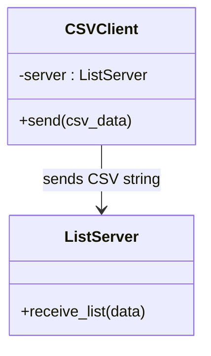
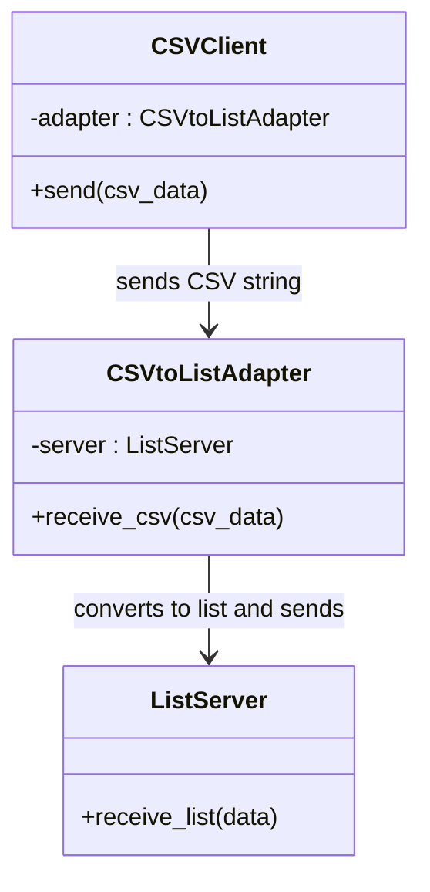

### "Python Programming: Problem Solving, Packages and Libraries" authored by Anurag Gupta and G.P. Biswas

### Without adapter

```mermaid

classDiagram
    class CSVClient {
        +send(csv_data)
        -server : ListServer
    }

    class ListServer {
        +receive_list(data)
    }

    CSVClient --> ListServer : sends CSV string

```

### With adapter

```mermaid

classDiagram
    class CSVClient {
        +send(csv_data)
        -adapter : CSVtoListAdapter
    }

    class CSVtoListAdapter {
        +receive_csv(csv_data)
        -server : ListServer
    }

    class ListServer {
        +receive_list(data)
    }

    CSVClient --> CSVtoListAdapter : sends CSV string
    CSVtoListAdapter --> ListServer : converts to list and sends


```

