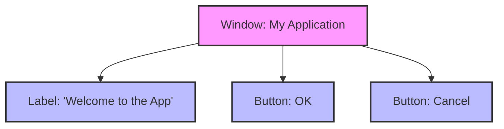

### "Python Programming: Problem Solving, Packages and Libraries" authored by Anurag Gupta and G.P. Biswas
### You can get the book on Amazon [Here](https://amzn.in/d/92pgv9Y)

---

#### A Script from my book which shows -- Composite Design Pattern (GUI Example) --

```python

# Base class (common interface)
class Widget:
    def render(self):
        """All widgets must define how they are drawn."""
        raise NotImplementedError("Subclass must implement render()")

# ---------- Leaf classes ----------
class Button(Widget):
    def __init__(self, text):
        self.text = text

    def render(self):
        print(f"Rendering Button: [{self.text}]")

class Label(Widget):
    def __init__(self, text):
        self.text = text

    def render(self):
        print(f"Rendering Label: '{self.text}'")

# -- One Composite class Window --
class Window(Widget):
    """Composite widget that can hold buttons, labels, etc."""
    def __init__(self, title):
        self.title = title
        self.children = []  # List of widgets inside the window

    def add(self, widget):
        """Add a widget (like Button or Label) to the window."""
        self.children.append(widget)

    def render(self):
        print(f"Rendering Window: {self.title}")
        # Render all child widgets
        for child in self.children:
            child.render()

# ---------- Usage (User side) ----------
# Create widgets
button1 = Button("OK")
button2 = Button("Cancel")
label = Label("Welcome to the App")

# Create window and add widgets
window = Window("My Application")
window.add(label)
window.add(button1)
window.add(button2)

# ---------- User Action ----------
window.render()  # Single call draws window and all widgets

```

#### Example diagram for script for Composite design pattern 



#### Explanation

* Label and Button are leaf components — they only know how to render themselves.

* Window is a composite component — it can contain and render multiple widgets.

* The pattern allows uniform treatment of simple and complex objects.
* Whether you render a Button, Label or an entire Window, the interface is the same: `component.render()`


