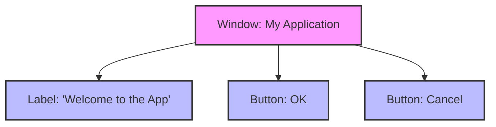

### "Python Programming: Problem Solving, Packages and Libraries" authored by Anurag Gupta and G.P. Biswas
### You can get the book on Amazon [Here](https://amzn.in/d/92pgv9Y)

---

#### Example diagram for script for Composite design pattern 

#### Explanation

* Label and Button are leaf components — they only know how to render themselves.

* Window is a composite component — it can contain and render multiple widgets.

* The pattern allows uniform treatment of simple and complex objects.
* Whether you render a Button, Label or an entire Window, the interface is the same: `component.render()`

