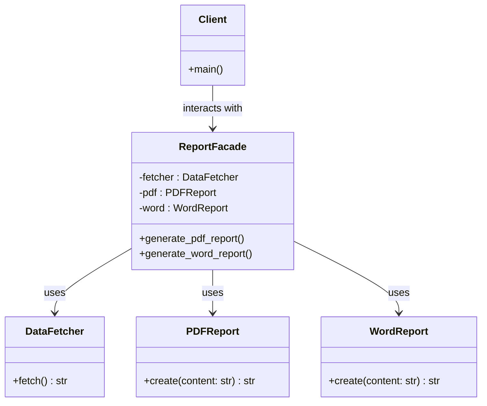

### Class diagram of the script for explaining facade design pattern given in the book

#### The various components can be explained by the table below:-
|  | Role | What it does |
| --- | --- | --- |
| 1 | DataFetcher | Gets the report data |
| 2 | PDFReport | Creates PDF report |
| 3 | WordReport | Creates Word report |
| 4 | ReportFacade | Simplifies access for the client |
| 5 | Client | Calls facade methods without worrying about details |

