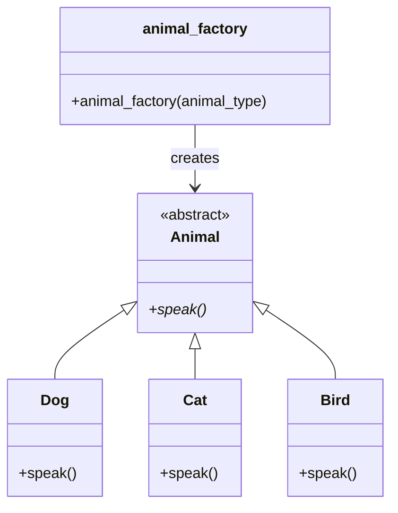

### Factory Pattern design

```mermaid

classDiagram
    direction TB

    class Animal {
        <<abstract>>
        +speak()*
    }

    class Dog {
        +speak()
    }

    class Cat {
        +speak()
    }

    class Bird {
        +speak()
    }

    class animal_factory {
        +animal_factory(animal_type)
    }

    Animal <|-- Dog
    Animal <|-- Cat
    Animal <|-- Bird
    animal_factory --> Animal : creates


```

