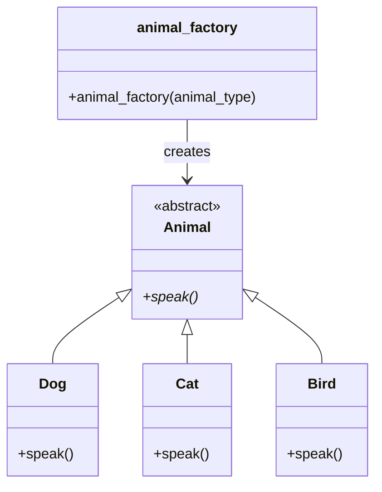

# Factory Pattern design




### Factory Design Pattern in Python — Animal Example

This example demonstrates the **Factory Design Pattern** in Python using animals 🐶🐱🐦.

The goal of the Factory Pattern is to **create objects without exposing the creation logic**.  
Instead of instantiating classes directly (`Dog()`, `Cat()`, etc.), we use a **factory function** that returns the appropriate object.

---

#### Step-by-Step Explanation

##### Step 1: Abstract Base Class — `Animal`

```python
from abc import ABC, abstractmethod

class Animal(ABC):
    """Abstract base class for all animals."""

    @abstractmethod
    def speak(self):
        """Each subclass must implement this method."""
        pass
```

* Animal is an abstract class — a blueprint for all animals.

* It declares a method speak() that must be implemented by subclasses.

* You cannot create an object of Animal directly.

* Think of it as a template that enforces rules for its children.


##### Step 2: Concrete Subclasses — Dog, Cat, Bird

```python

class Dog(Animal):
    def speak(self):
        return "Woof! Woof!"

class Cat(Animal):
    def speak(self):
        return "Meow!"

class Bird(Animal):
    def speak(self):
        return "Chirp! Chirp!"
```

Each subclass provides its own implementation of speak().

#### Table showing the various animals created and their speak() sounds

| Animal | Sound |
| --- | --- |
| Dog | "Woof! Woof!" |
| Cat | "Meow!" |
| Bird | "Chirp! Chirp!" |


#### Step 3: Factory Function — animal_factory()

```python

def animal_factory(animal_type):
    """Factory function that creates and returns the right Animal object."""
    if animal_type.lower() == "dog":
        return Dog()
    elif animal_type.lower() == "cat":
        return Cat()
    elif animal_type.lower() == "bird":
        return Bird()
    else:
        raise ValueError(f"Unknown animal type: {animal_type}")
```

* The factory function decides which class to instantiate.

* It hides the creation details from the user.

* Think of it like a machine — you give it a label ("Dog", "Cat", "Bird") and it hands you the right animal object.


Step 4: Demonstration — Using the Factory
print("=== Factory Design Pattern Demo ===\n")

for animal_type in ["Dog", "Cat", "Bird"]:
    animal = animal_factory(animal_type)
    print(f"Created a {animal_type}")
    print(f"{animal_type} says → {animal.speak()}")
    print("-" * 30)


#### Output:

```python

=== Factory Design Pattern Demo ===

Created a Dog
Dog says → Woof! Woof!
------------------------------
Created a Cat
Cat says → Meow!
------------------------------
Created a Bird
Bird says → Chirp! Chirp!
------------------------------

```

#### Why Use the Factory Pattern?

* Simplifies object creation
* Makes the code easier to extend (add new animals easily)
* Promotes loose coupling (main code doesn’t depend on class names)
* Follows the Open/Closed Principle — open for extension, closed for modification


