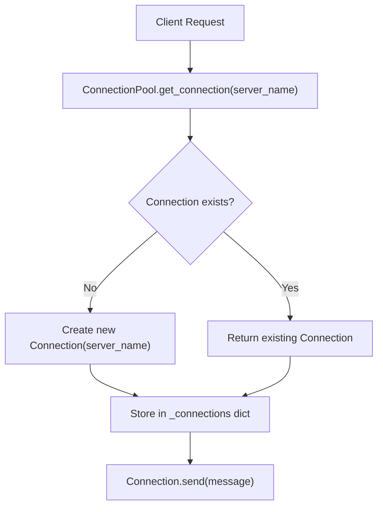
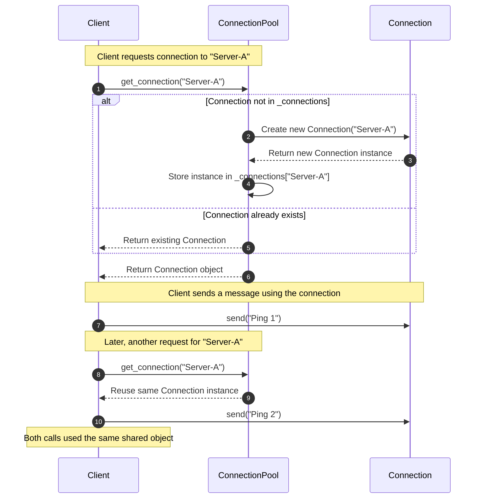
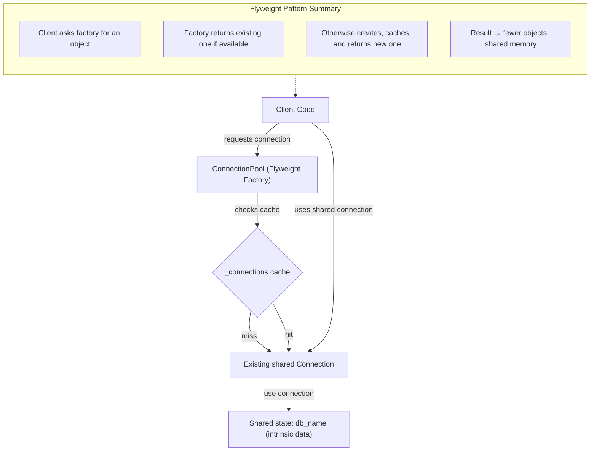

## Flyweight pattern implementation example

```python
class Connection:
    """Flyweight: Represents a reusable shared connection (simulated)."""
    def __init__(self, server_name):
        self.server_name = server_name
        print(f"🔌 Creating new connection to '{server_name}'")

    def send(self, message):
        print(f"[{self.server_name}] Sending message → {message}")


class ConnectionPool:
    """Flyweight Factory: Creates & reuses 
    shared Connection objects."""
    _connections = {}

    @classmethod
    def get_connection(cls, server_name):
        if server_name not in cls._connections:
            cls._connections[server_name] = Connection(server_name)
        else:
            print(f"Reusing existing connection to-> '{server_name}'")
        return cls._connections[server_name]


# --- Client Code ---
pool = ConnectionPool()

# Multiple clients requesting connections
conn1 = pool.get_connection("Server-A")
conn2 = pool.get_connection("Server-B")
conn3 = pool.get_connection("Server-A")  # Reuses conn1

# Use connections to send messages
conn1.send("Ping 1")
conn2.send("Ping 2")
conn3.send("Ping 3 (same connection as Ping 1)")

# Verify shared flyweight
print("\nIs conn1 same as conn3?", conn1 is conn3)

```

#### Flowchart showing the execution of above script



#### Sequence Diagram — Flyweight (Connection Pool)



#### Python code diagram (with arrows showing calls like get_connection → Connection() → send() flow




