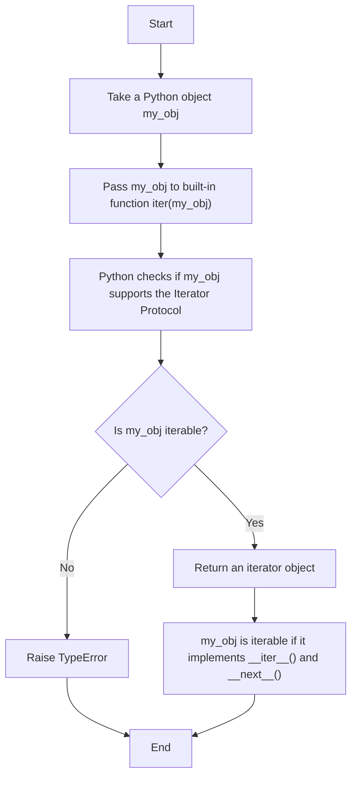
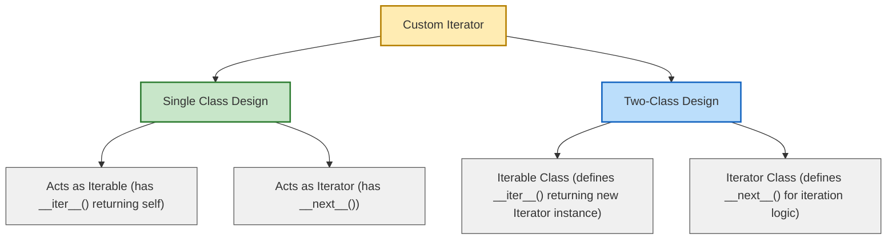
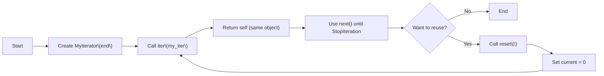

### Implementation of the iterator protocol



### Custom iterators can be created in 2 different ways
1. Where there is a single class acting as both iterable and iterator
2. Where there are 2 distinct classes (a) For iterable (b) for iterator



### Python script for creating a custom iterator in a single class design (But which can only be used once)

```python
class MyIterator:
    def __init__(self, end):
        self.current = 0
        self.end = end

    def __iter__(self):
        return self

    def __next__(self):
        if self.current < self.end:
            value = self.current
            self.current += 1
            return value
        else:
            raise StopIteration

# Create an iterator object
my_iter = MyIterator(5)  # will produce numbers 0 to 4

# Manually loop through iterator
while True:
    try:
        num = next(my_iter)  # get next element
    except StopIteration:
        break  # stop when iterator is exhausted
    print(num)
print("Done!")

```

### Python script for creating a custom iterator in a single class design (Which can be used again because it has a `reset()` method)

```python
class MyIterator:
    def __init__(self, end):
        self.end = end
        self.current = 0

    def __iter__(self):
        return self

    def __next__(self):
        if self.current < self.end:
            value = self.current
            self.current += 1
            return value
        else:
            raise StopIteration

    def reset(self):
        """Reset iteration so it can start again."""
        self.current = 0

# --- Demo ---
my_iter = MyIterator(5)

# First iteration
print("First pass:")
for num in my_iter:
    print(num)

# Reset and reuse
my_iter.reset()

print("\nSecond pass (after reset):")
for num in my_iter:
    print(num)


```


#### Flow chart for the above script



#### Two class design

```python

class MyIterable:
    def __init__(self, end):
        self.end = end

    def __iter__(self):
        # Return a new iterator every time
        return MyIterator(self.end)

class MyIterator:
    def __init__(self, end):
        self.current = 0
        self.end = end

    def __next__(self):
        if self.current < self.end:
            value = self.current
            self.current += 1
            return value
        else:
            raise StopIteration

# --- Demo ---
my_obj = MyIterable(5)

print("First pass:")
for num in my_obj:
    print(num)

print("\nSecond pass (fresh iterator automatically):")
for num in my_obj:
    print(num)


```


