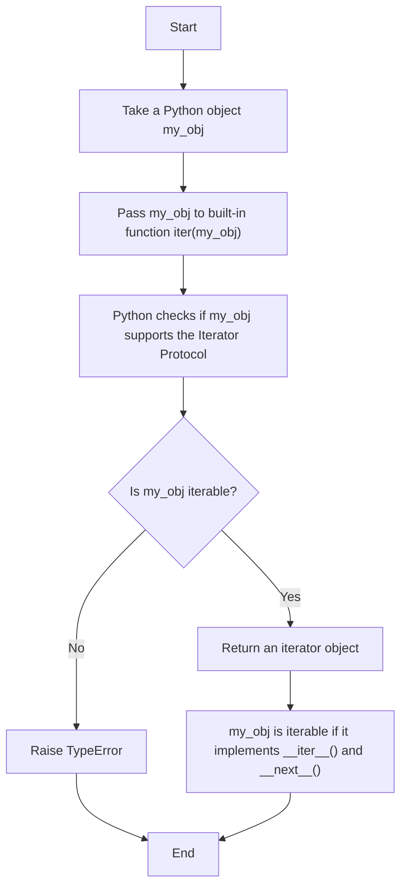

```mermaid
flowchart TD
    A["Start"] --> B["Take a Python object my_obj"]
    B --> C["Pass my_obj to built-in function iter(my_obj)"]
    C --> D["Python checks if my_obj supports the Iterator Protocol"]
    D --> E{"Is my_obj iterable?"}
    E -- No --> F["Raise TypeError"]
    E -- Yes --> G["Return an iterator object"]
    G --> H["my_obj is iterable if it implements __iter__() and __next__()"]
    F --> I["End"]
    H --> I


```

