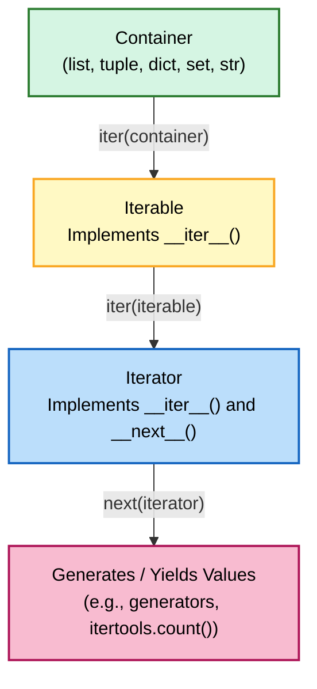

```mermaid
graph TD
    A["Container<br>(list, tuple, dict, set, str)"]
    B["Iterable<br>Implements __iter__()"]
    C["Iterator<br>Implements __iter__() and __next__()"]
    D["Generates / Yields Values<br>(e.g., generators, itertools.count())"]

    A -->|"iter(container)"| B
    B -->|"iter(iterable)"| C
    C -->|"next(iterator)"| D

    classDef cont fill:#d5f5e3,stroke:#2e7d32,stroke-width:2px,color:#000;
    classDef iter fill:#fff9c4,stroke:#f9a825,stroke-width:2px,color:#000;
    classDef itor fill:#bbdefb,stroke:#1565c0,stroke-width:2px,color:#000;
    classDef gen fill:#f8bbd0,stroke:#ad1457,stroke-width:2px,color:#000;

    class A cont;
    class B iter;
    class C itor;
    class D gen;
```

