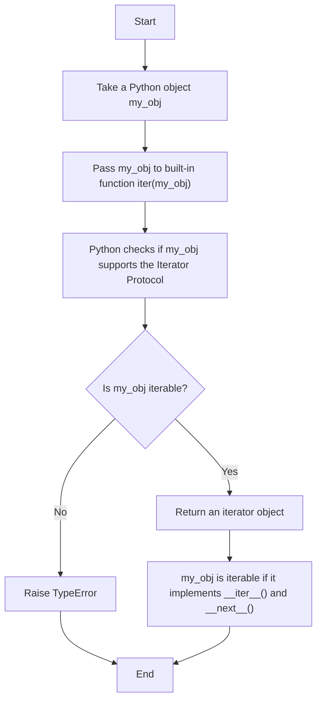
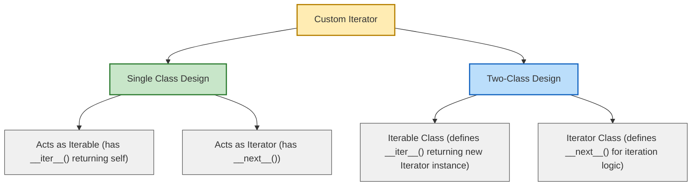

### Implementation of the iterator protocol

### Custom iterators can be created in 2 different ways
1. Where there is a single class acting as both iterable and iterator
2. Where there are 2 distinct classes (a) For iterable (b) for iterator

