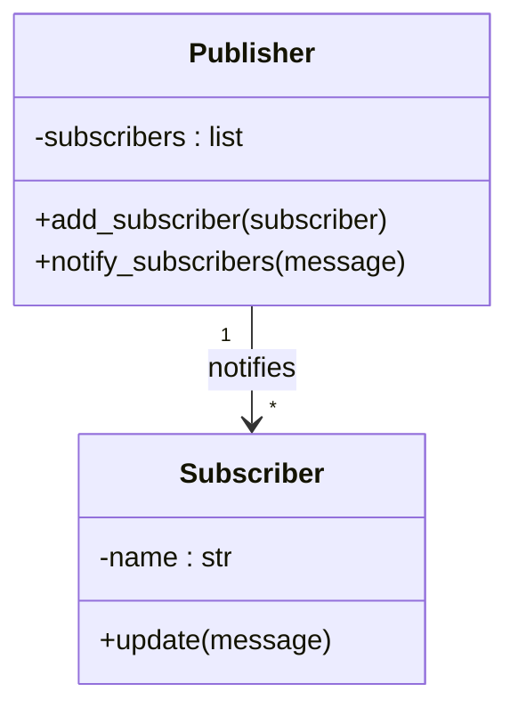

#### Class diagram for observer design pattern

```mermaid

classDiagram
    %% Publisher (Subject)
    class Publisher {
        -subscribers : list
        +add_subscriber(subscriber)
        +notify_subscribers(message)
    }

    %% Subscriber (Observer)
    class Subscriber {
        -name : str
        +update(message)
    }

    %% Relationships
    Publisher "1" --> "*" Subscriber : notifies


```

