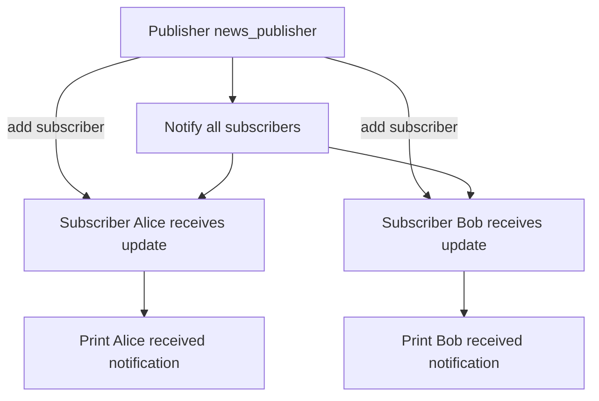

### "Python Programming: Problem Solving, Packages and Libraries" authored by Anurag Gupta and G.P. Biswas
### You can get the book on Amazon [Here](https://amzn.in/d/92pgv9Y)

---

#### Class diagram for observer design pattern

### Explanation of the Diagram

1.  **Classes**:
    
    *   `Publisher` → maintains a list of subscribers and notifies them.
        
    *   `Subscriber` → receives updates via `update(message)`.
        
2.  **Attributes**:
    
    *   `subscribers` → list of all attached subscribers.
        
    *   `name` → unique identifier for each subscriber.
        
3.  **Methods**:
    
    *   `add_subscriber(subscriber)` → attach a subscriber.
        
    *   `notify_subscribers(message)` → send updates to all subscribers.
        
    *   `update(message)` → reaction of the subscriber.

4.  **Relationship**:
    
    *   Publisher **notifies multiple subscribers** (`1 → *` relationship).

#### Flowchart of the script in the book

        

