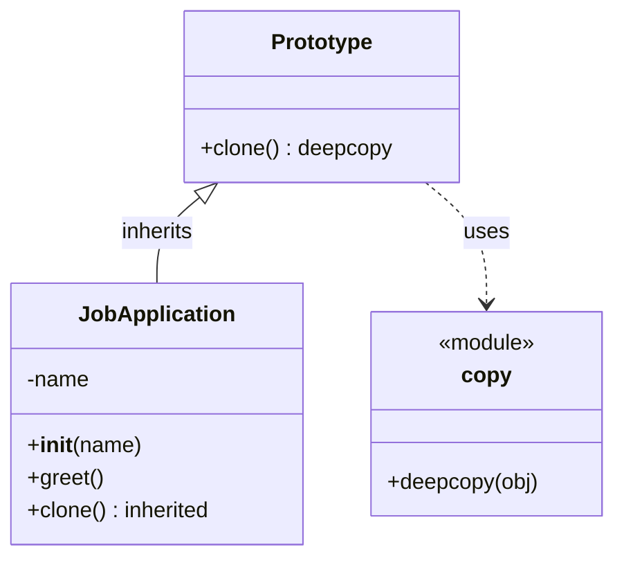

### Class diagram for the example code on Prototype design pattern

**Explanation of the diagram**
* Prototype
    * Base class that defines the method clone() which performs a deep copy of the object.
    * Uses the copy module internally.
* JobApplication
    * Inherits from Prototype.
    * Has an instance attribute name.
    * Defines its own constructor (__init__) and greet() method.
    * Inherits the clone() method from the base class.
* copy module
    * External dependency used by Prototype for cloning via deepcopy.

