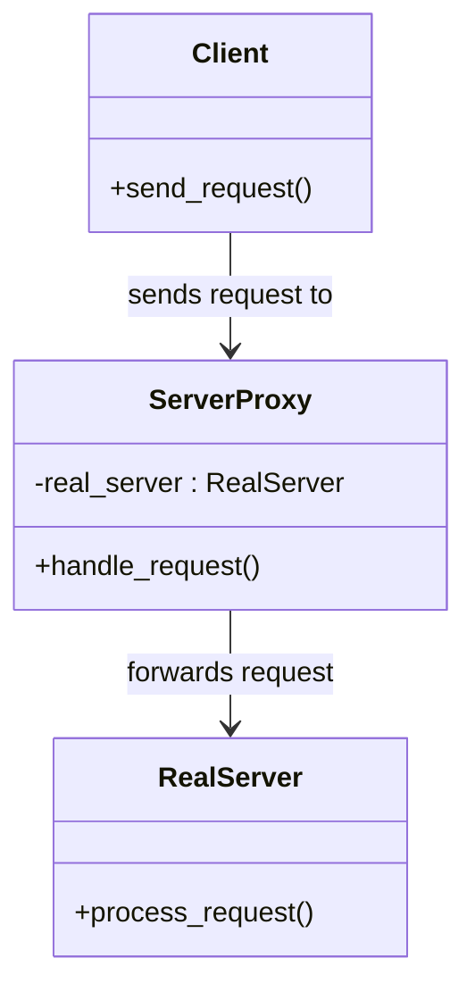

#### Proxy script class diagram

```mermaid

classDiagram
    class Client {
        +send_request()
    }

    class ServerProxy {
        -real_server : RealServer
        +handle_request()
    }

    class RealServer {
        +process_request()
    }

    Client --> ServerProxy : sends request to
    ServerProxy --> RealServer : forwards request


```

