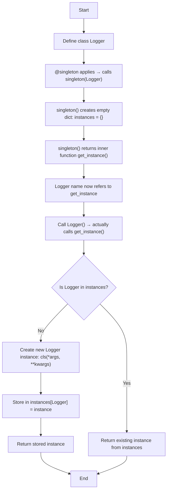

###Singleton Pattern

#### Creating Singleton class using decorator

```python

def singleton(cls):
    instances = {}
    def get_instance(*args, **kwargs):
        if cls not in instances:
            instances[cls] = cls(*args, **kwargs)
        return instances[cls]
    return get_instance

@singleton
class Logger:
    def __init__(self):
        print("Logger initialized")

# Test
log1 = Logger()
log2 = Logger()
print("Are log1 and log2 same instance?->", log1 is log2) # True


```

### Flowchart for above code




