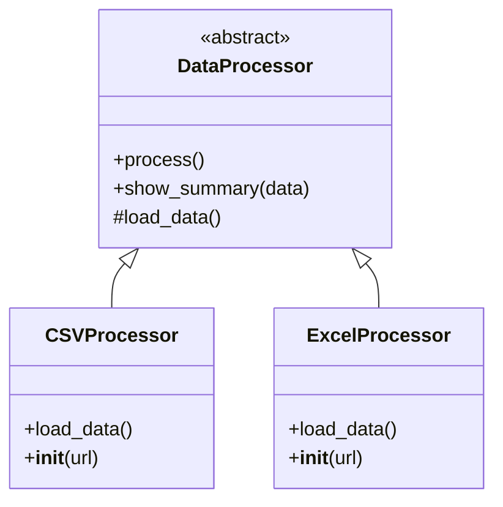

## **Template Design Pattern**

### Python example script which shows the use of Template design pattern


```python
from abc import ABC, abstractmethod
import pandas as pd

# --- 1️ Abstract Base Class: Defines the Template ---
class DataProcessor(ABC):
    """Defines the template for data loading and display."""

    def process(self):
        """Template method — defines the overall workflow."""
        print(f"1=== {self.__class__.__name__} Workflow Start ===")
        data = self.load_data()
        self.show_summary(data)
        print(f"=== {self.__class__.__name__} Workflow Complete ===\n")

    @abstractmethod
    def load_data(self):
        """Abstract method — subclasses define how to load data."""
        pass

    def show_summary(self, data):
        """Common method — same for all subclasses."""
        print("Data loaded successfully!")
        print("Showing first few rows:\n")
        print(data.head())  # Display top 5 rows

# --- 2️ Concrete Subclass: CSV Data Processor ---
class CSVProcessor(DataProcessor):
    def __init__(self, url):
        self.url = url

    def load_data(self):
        print(f"Loading CSV data from {self.url}")
        return pd.read_csv(self.url)

# --- 3️ Concrete Subclass: Excel Data Processor ---
class ExcelProcessor(DataProcessor):
    def __init__(self, url):
        self.url = url

    def load_data(self):
        print(f"Loading Excel data from {self.url}")
        return pd.read_excel(self.url)

# --- 4️ Client Code ---
if __name__ == "__main__":
    print("=== Template Method Pattern Demo (pandas) ===")

    # Real open-source datasets (hosted on GitHub)
    csv_url = "https://raw.githubusercontent.com/ag999git/data-sets/main/popular_python_libraries_AI_NLP_ML.csv"
    excel_url = "https://raw.githubusercontent.com/ag999git/data-sets/main/Popular-python-libraries.xlsx"

    # Process CSV
    csv_processor = CSVProcessor(csv_url)
    csv_processor.process()

    # Process Excel
    excel_processor = ExcelProcessor(excel_url)
    excel_processor.process()


```
### The output of the above script is as follows:-

```python
=== Template Method Pattern Demo (pandas) ===
1=== CSVProcessor Workflow Start ===
Loading CSV data from https://raw.githubusercontent.com/ag999git/data-sets/main/popular_python_libraries_AI_NLP_ML.csv
Data loaded successfully!
Showing first few rows:

  Name of Library  ...                                   GitHub URL
0            NLTK  ...                 https://github.com/nltk/nltk
1           spaCy  ...           https://github.com/explosion/spaCy
2          Gensim  ...  https://github.com/RaRe-Technologies/gensim
3    Transformers  ...  https://github.com/huggingface/transformers
4        TextBlob  ...           https://github.com/sloria/TextBlob

[5 rows x 8 columns]
=== CSVProcessor Workflow Complete ===

1=== ExcelProcessor Workflow Start ===
Loading Excel data from https://raw.githubusercontent.com/ag999git/data-sets/main/Popular-python-libraries.xlsx
Data loaded successfully!
Showing first few rows:

  Name of Library  ...                                    GitHub URL
0           NumPy  ...                https://github.com/numpy/numpy
1          Pandas  ...          https://github.com/pandas-dev/pandas
2      Matplotlib  ...      https://github.com/matplotlib/matplotlib
3         Seaborn  ...            https://github.com/mwaskom/seaborn
4    Scikit-learn  ...  https://github.com/scikit-learn/scikit-learn

[5 rows x 7 columns]
=== ExcelProcessor Workflow Complete ===
```

### The above script can be shown as a class diagram as follows:-




### EXPLANATION

#### **1. Define the abstract base class**

class `DataProcessor(ABC)`:    """Defines the template for data loading and display."""

·       `DataProcessor` is the **base (parent) class**.

·       It **inherits from** `ABC`, which means it can contain **abstract methods**.

·       This class defines a **template** — a fixed _workflow_ that subclasses will follow.

##### **1.(a) The `process()`  method (Template Method) of the abstract base class `DataProcessor`**

```python
def process(self):    """Template method — defines the overall workflow."""    print(f"1=== {self.__class__.__name__} Workflow Start ===")  
    data = self.load_data()  
    self.show_summary(data)  
    print(f"=== {self.__class__.__name__} Workflow Complete ===\n")
```

This is the **template method** that defines the **fixed sequence of steps** every data processor must follow:

1.  Start message (Workflow Start)
2.  Call `load_data()` → load the dataset
3.  Call `show_summary()` → show first few rows
4.  End message (Workflow Complete)

*   Note:  
    `self.__class__.__name__` gives the **name of the current class**, e.g. `CSVProcessor` or `ExcelProcessor`.  
    That’s why it prints which subclass is running the workflow.
*   This method is **inherited** by all subclasses — it is the same for both CSV and Excel.

##### **1.(b) The abstract method of the abstract base class `DataProcessor`**
```python
@abstractmethod  
def load_data(self):    #Abstract method — subclasses define how to load data.
    pass
```
*   This is an **abstract method** — it has no body (pass = do nothing).
*   It forces every subclass (child class) to implement its **own version** of `load_data()`.  
    Otherwise, Python won’t let you create an object of that subclass.

_Think of this as a “placeholder” — the parent class says “I don’t know how you’ll load the data; you decide.”_

##### **The shared method (common to all subclasses)**

```python
def show_summary(self, data):    """Common method — same for all subclasses."""    print("Data loaded successfully!")  
    print("Showing first few rows:\n")  
    print(data.head())  # Display top 5 rows
```
*   This is a **normal method** that all subclasses inherit.
*   It prints a short summary of the loaded data.
*   `data.head()` is a pandas function that shows the first 5 rows of a DataFrame.
*   Same for both CSV and Excel processors — so no need to redefine it.

#### **2. Subclass 1 — `CSVProcessor`**

```python
class CSVProcessor(DataProcessor):    def __init__(self, url):  
        self.url = url    def load_data(self):  
        print(f"Loading CSV data from {self.url}")        return pd.read_csv(self.url)
```
*   This class **inherits** from DataProcessor.
*   It defines how to **load CSV data**:

*   `__init__()` saves the file URL (the data source).
*   `load_data()` uses `pandas.read_csv()` to load the data.

*   It **inherits** the `process()` and `show_summary()` methods automatically from the parent.

#### **3. Subclass 2 — `ExcelProcessor`**

```python
class ExcelProcessor(DataProcessor):    def __init__(self, url):  
        self.url = url    def load_data(self):  
        print(f"Loading Excel data from {self.url}")        return pd.read_excel(self.url)
```
*   This class also **inherits** from DataProcessor.
*   It has same pattern as `CSVProcessor`, but this one loads **Excel files**.
*   It uses `pandas.read_excel()` instead of `read_csv()`.

#### **4. The Client Code (main program)**
```python
if __name__ == "__main__":  
    print("=== Template Method Pattern Demo (pandas) ===")
```
*   This block runs **only** when the script is executed directly (not when imported).
*   It’s the **entry point** of the program.

#### **5. Define dataset URLs**
```python
csv_url = "https://raw.githubusercontent.com/ag999git/data-sets/main/popular_python_libraries_AI_NLP_ML.csv"
excel_url = "https://raw.githubusercontent.com/ag999git/data-sets/main/Popular-python-libraries.xlsx"

```
*   These are **GitHub raw links** to real datasets. Both these datbases have been created by me and are available on GitHub.
*   You can see the the .csv data [by clicking on this link](https://raw.githubusercontent.com/ag999git/data-sets/main/popular_python_libraries_AI_NLP_ML.csv)
*   And you can download the .xlsx (Excel) data by [clicking the link here](https://raw.githubusercontent.com/ag999git/data-sets/main/Popular-python-libraries.xlsx)
*   So, the data being used for this example is not on the local machine but rather on GitHub.

#### **6. Create objects and run workflows**
```python
# Process CSV  
csv_processor = CSVProcessor(csv_url)  
csv_processor.process()  
  
# Process Excel  
excel_processor = ExcelProcessor(excel_url)  
excel_processor.process()
```
*   Creates an object of each subclass and passes the file URL.
*   Calls `process()` — the template method in the parent class.

#### 7. What happens step-by-step for **CSVProcessor** 

1.  `csv_processor.process()` runs `DataProcessor.process()`
2.  Inside that method:

*   Calls `self.load_data()` → actually runs `CSVProcessor.load_data()`
*   Then calls `self.show_summary(data)` from parent

4.  Prints workflow start and complete messages.

The same happens for `ExcelProcessor`, except it loads Excel data.

***
### Some questions on above script

#### **Q1. Why is there no `__init__()` method in `DataProcessor(ABC)` ?**

***Short Answer:***

Because DataProcessor is an **abstract base class** — it only defines a _workflow (template)_, not data or attributes that need initialization.

Detailed Explanation:

*   DataProcessor defines **structure and rules**, not actual data.
*   Its purpose is to say:- “Any subclass must define `load_data()` and can reuse `show_summary()` and `process()`.”
*   It doesn’t need instance variables like `self.url` because those belong to the specific data type (CSV or Excel). Those subclasses handle their own initialization.

#### **Q2. Does `CSVProcessor(DataProcessor)` call the superclass methods even though there’s no `super()` ?**

**Short Answer:**

Yes — **automatically**.  
`super()` is only needed when _you explicitly override_ a method but still want to use the parent version.

**Explanation:**

*   In Python, if a subclass does **not override** a method, the method is automatically inherited and used from the superclass.
*   Here:

*   CSVProcessor does **not** override `process()` or `show_summary()` — both are inherited directly from DataProcessor.
*   So when we call:

```python
csv_processor.process()
```
·       Python automatically runs 
```python
DataProcessor.process()
```
which in turn calls 
```python
self.load_data()
```

*   Since CSVProcessor **does override `load_data()` **, that subclass version is called at runtime due to **polymorphism**.

### **Step-by-step flow:**

1.  `csv_processor.process()` → found in superclass DataProcessor.
2.  Inside `process()`, it calls `self.load_data()` .
3.  Because the instance is a `CSVProcessor` , Python looks for `load_data()` there first.
4.  Finds it → executes `CSVProcessor.load_data()`.
5.  When done, control returns to process() in the superclass.
***
| Concept | Explanation |
| --- | --- |
| Abstract class (ABC) | Used to define a base structure that cannot be instantiated |
| Abstract method | A placeholder that must be implemented by subclasses |
| Template Method Pattern | Parent defines the skeleton of a process; subclasses fill in specific steps |
| Inheritance | Subclasses reuse methods from the parent (process, show_summary) |
| Polymorphism | self.load_data() calls the correct version based on the actual class (CSV/Excel) |
| pandas | Used here to load and display tabular data |


