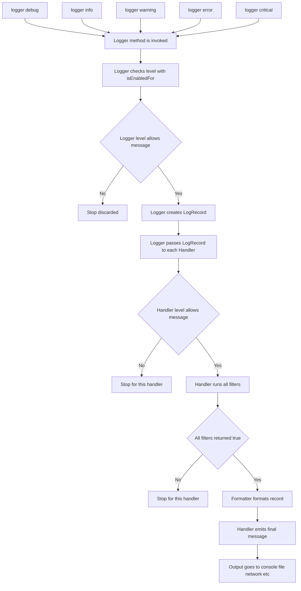

### Logging

```mermaid

flowchart TD

A1[logger debug] --> B[Logger method is invoked]
A2[logger info] --> B
A3[logger warning] --> B
A4[logger error] --> B
A5[logger critical] --> B

B --> C[Logger checks level with isEnabledFor]

C --> D{Logger level allows message}
D -->|No| Z1[Stop discarded]
D -->|Yes| E[Logger creates LogRecord]

E --> F[Logger passes LogRecord to each Handler]

F --> G{Handler level allows message}
G -->|No| Z2[Stop for this handler]
G -->|Yes| H[Handler runs all filters]

H --> I{All filters returned true}
I -->|No| Z3[Stop for this handler]
I -->|Yes| J[Formatter formats record]

J --> K[Handler emits final message]

K --> L[Output goes to console file network etc]

```

