### DRY Principle
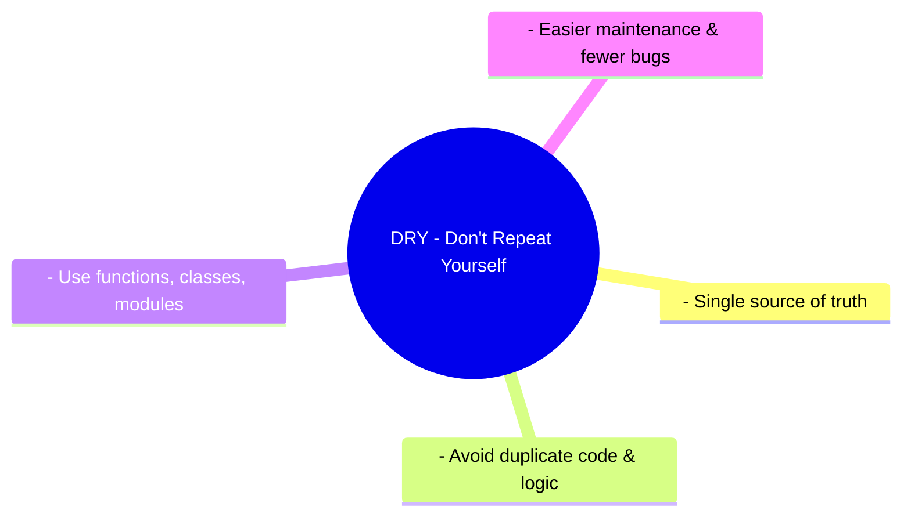

### Zen of Python
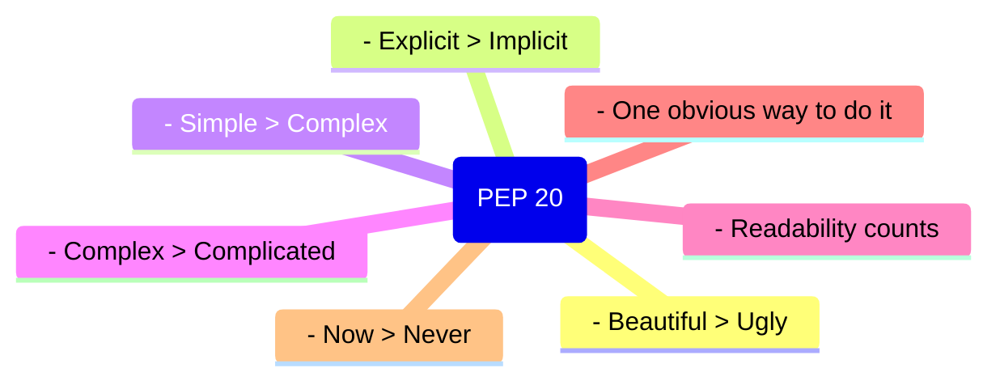


### Separation of Concerns Hierarchy in Python

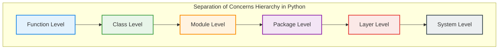

### Creational Design Patterns 1

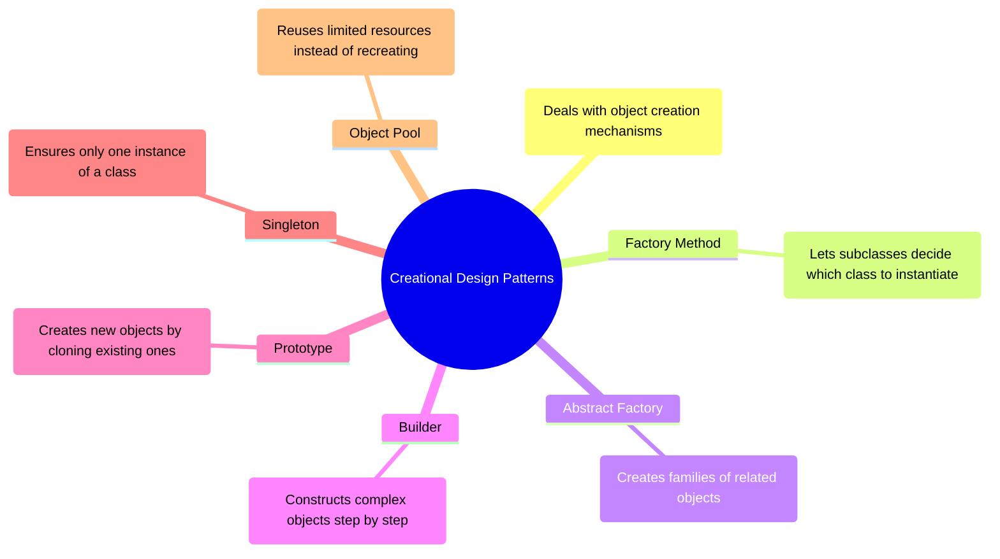
### Creational Design Patterns 2


### Structural Design Patterns 1

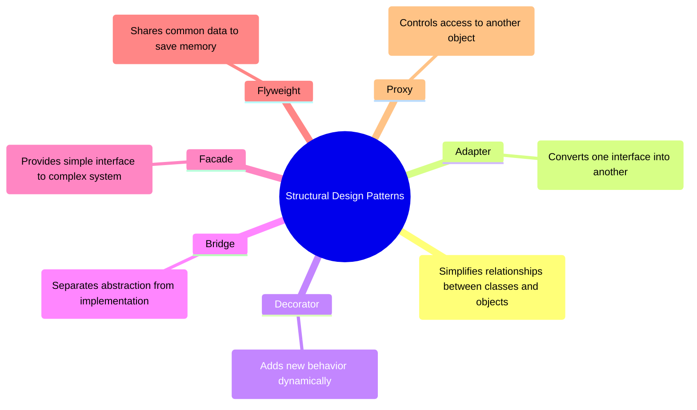
### Structural Design Patterns 2


### Behavioral Design Patterns 1

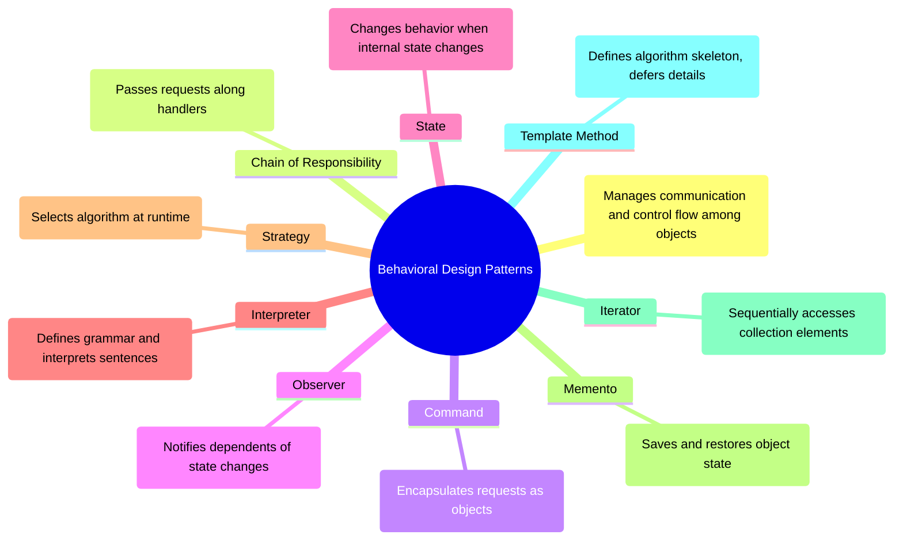
### Behavioral Design Patterns 2


### Architectural Patterns 1

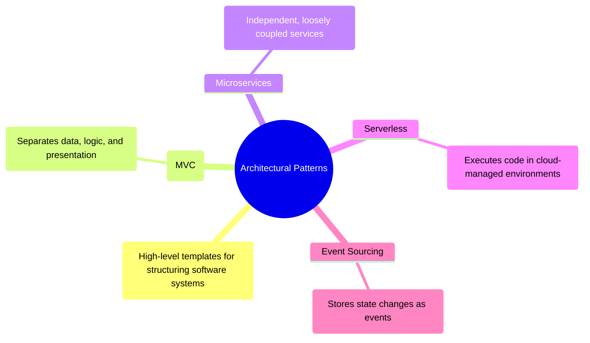
### Architectural Patterns 2


### Concurrency & Asynchronous Patterns 1

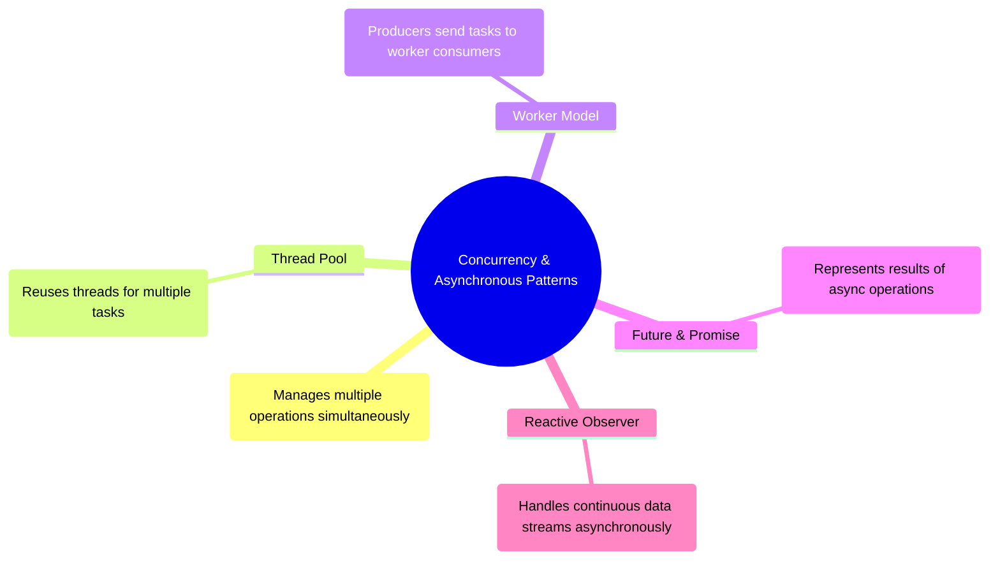

### Concurrency & Asynchronous Patterns 2


### Performance Patterns

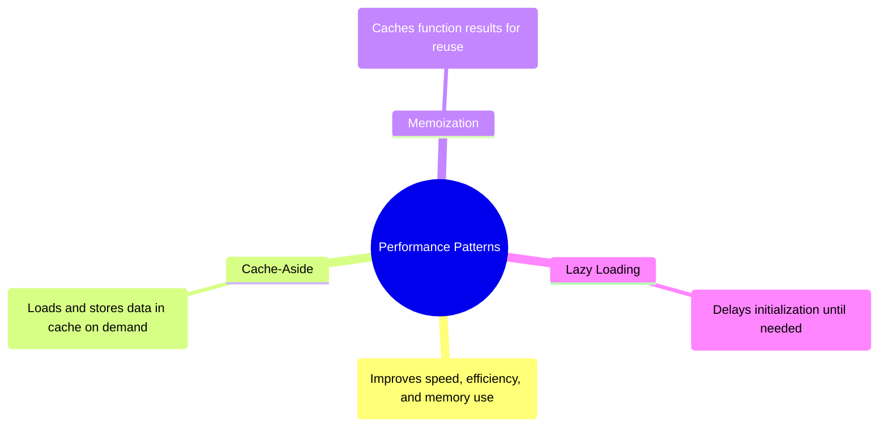
### Distributed Systems Patterns

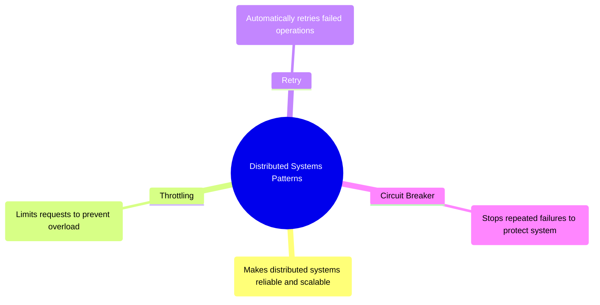
### Testing Patterns

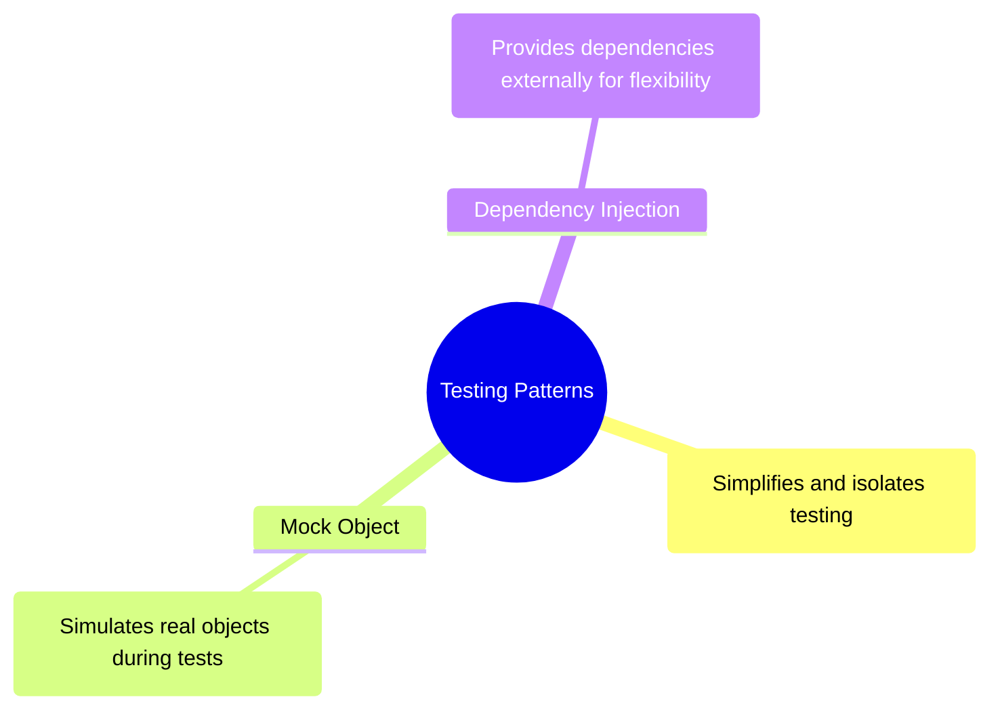


```mermaid


```
