Creational design pattern


Structural Design Patterns (Class & Object Composition)


Behavioral Design Patterns (Object Interaction)

```mermaid
mindmap
  root((Behavioral Design Patterns))
    Chain of Responsibility
      : Passes requests along a chain of handlers.
    Command
      : Encapsulates a request as an object.
    Iterator
      : Sequentially access elements in a collection.
    Mediator
      : Simplifies communication between classes.
    Memento
      : Captures and restores object’s internal state.
    Observer
      : Notifies dependents of state changes.
    State
      : Changes behavior when internal state changes.
    Strategy
      : Selects algorithm behavior at runtime.
    Template Method
      : Defines algorithm skeleton, lets subclasses override steps.
    Visitor
      : Separates algorithms from object structure.


```




Separation of Concerns Hierarchy in Python


Creational Design Patterns


```mermaid


```


```mermaid


```


```mermaid


```
