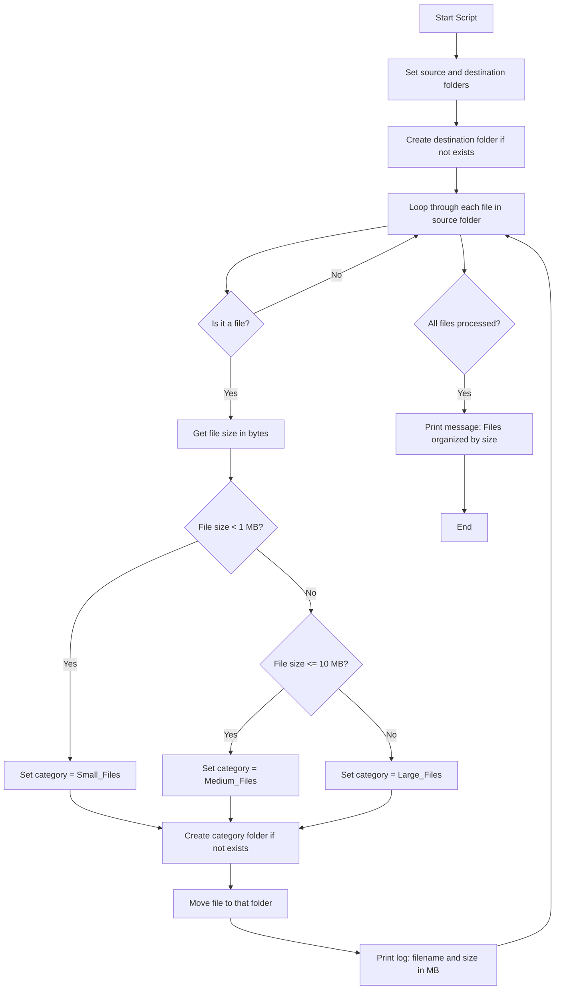

### Flowchart

```mermaid

flowchart TD

A[Start Script] --> B[Set source and destination folders]
B --> C[Create destination folder if not exists]
C --> D[Loop through each file in source folder]

D --> E{Is it a file?}
E -- No --> D
E -- Yes --> F[Get file size in bytes]

F --> G{File size < 1 MB?}
G -- Yes --> H[Set category = Small_Files]
G -- No --> I{File size <= 10 MB?}
I -- Yes --> J[Set category = Medium_Files]
I -- No --> K[Set category = Large_Files]

H --> L
J --> L
K --> L

L[Create category folder if not exists] --> M[Move file to that folder]
M --> N[Print log: filename and size in MB]
N --> D

D --> O{All files processed?}
O -- Yes --> P[Print message: Files organized by size]
P --> Q[End]


```

