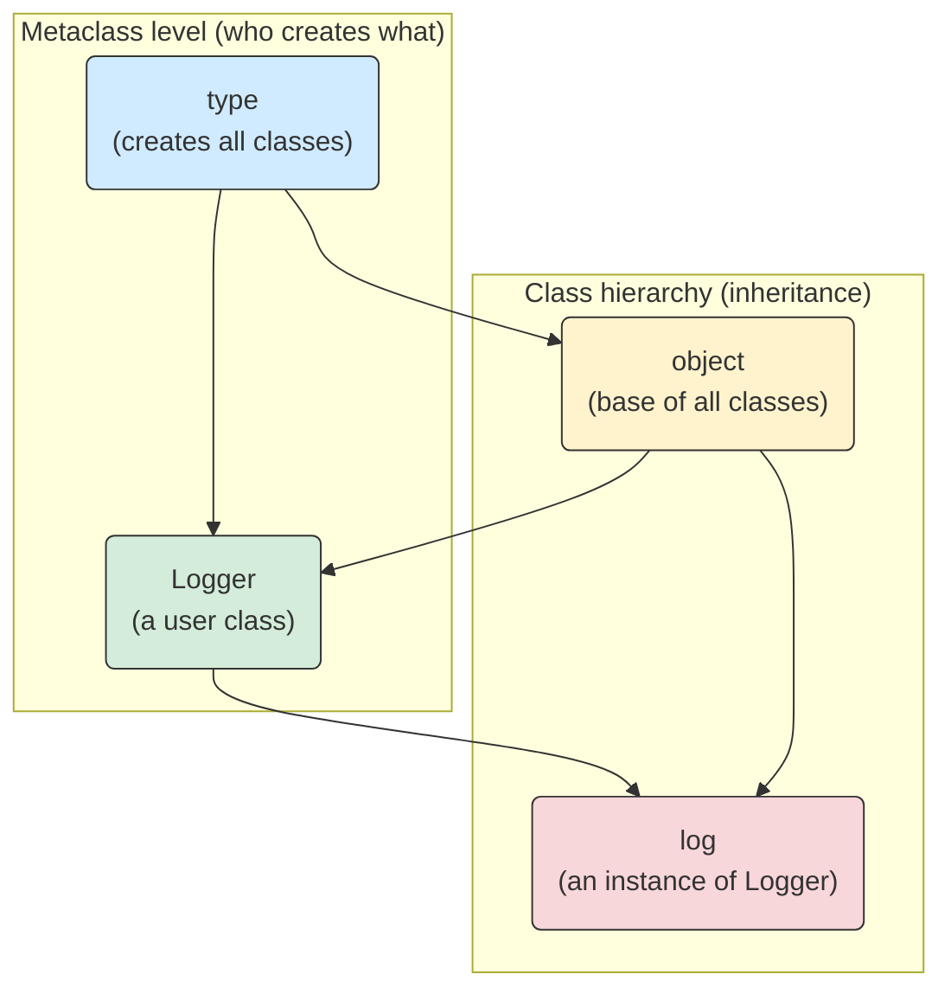

#### --- "Metaclass level (who creates what)" ---

```python
# --- "Metaclass level (who creates what)" ---

# In Python, 'type' is itself a class (metaclass)
print("'type' is a class that creates all other classes.")
print("type(type) ->", type(type))      # type creates itself!
print("type(object) ->", type(object))  # type creates object

# --- "Class hierarchy (inheritance)" ---

# object is the ultimate base class
print("'object' is the root of all classes.")
print("object.__bases__ ->", object.__bases__)  # ()

# Create a user-defined class
class Logger:
    pass

print("'Logger' is a user-defined class created by 'type'.")
print("type(Logger) ->", type(Logger))          # type
print("Logger.__bases__ ->", Logger.__bases__)  # (object,)

# Create an instance of Logger
log = Logger()

print("'log' is an instance of Logger.")
print("type(log) ->", type(log))                # Logger
print("isinstance(log, Logger) ->", isinstance(log, Logger))  # True
print("isinstance(log, object) ->", isinstance(log, object))  # True

# --- Visual relationships in code form ---
print("Relationships:")
print("type --> Logger  (type creates classes like Logger)")
print("type --> object  (type creates object)")
print("object --> Logger (Logger inherits from object)")
print("Logger --> log    (Logger creates instances)")
print("object --> log    (All instances ultimately inherit from object)")


```

#### Give a script showing the core creation and inheritance relationships in Python’s object model.

```python

'type' is a class that creates all other classes.
type(type) -> <class 'type'>
type(object) -> <class 'type'>
'object' is the root of all classes.
object.__bases__ -> ()
'Logger' is a user-defined class created by 'type'.
type(Logger) -> <class 'type'>
Logger.__bases__ -> (<class 'object'>,)
'log' is an instance of Logger.
type(log) -> <class '__main__.Logger'>
isinstance(log, Logger) -> True
isinstance(log, object) -> True
Relationships:
type --> Logger  (type creates classes like Logger)
type --> object  (type creates object)
object --> Logger (Logger inherits from object)
Logger --> log    (Logger creates instances)
object --> log    (All instances ultimately inherit from object)

```

#### The flowchart for this is

#### visualize the relationships between `type` and `object` in Python



