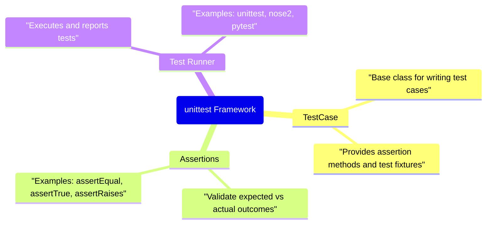
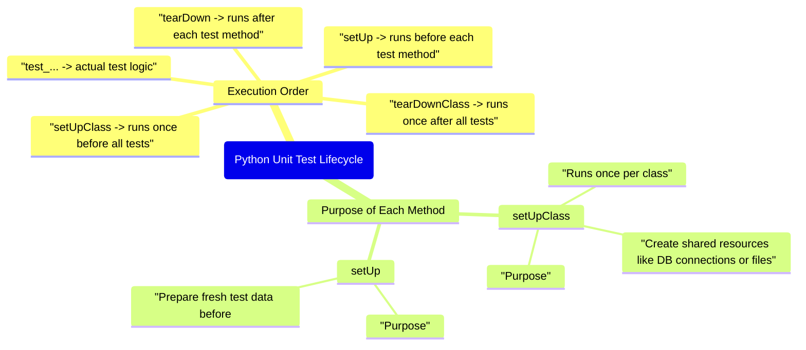
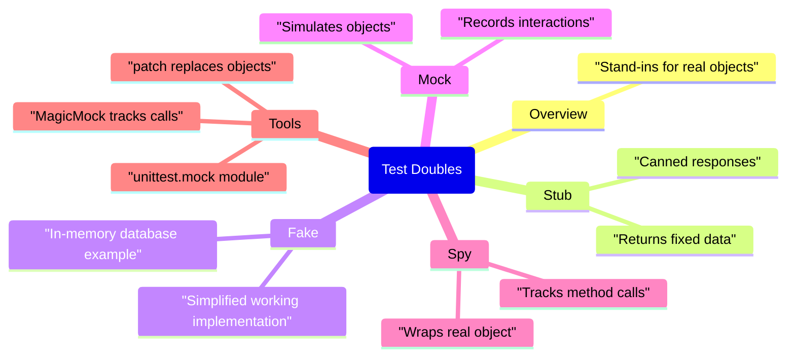
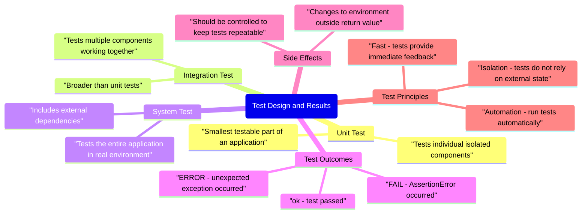

### 1. unittest Framework Basics

```mermaid

mindmap
  root("unittest Framework")

    TestCase
      "Base class for writing test cases"
      "Provides assertion methods and test fixtures"

    Assertions
      "Validate expected vs actual outcomes"
      "Examples: assertEqual, assertTrue, assertRaises"

    Test Runner
      "Executes and reports tests"
      "Examples: unittest, nose2, pytest"


```
---

### 2. Test Lifecycle

```mermaid


mindmap
  root("Python Unit Test Lifecycle")

    Execution Order
      "setUpClass -> runs once before all tests"
      "setUp -> runs before each test method"
      "test_... -> actual test logic"
      "tearDown -> runs after each test method"
      "tearDownClass -> runs once after all tests"

    Purpose of Each Method
      setUpClass
        "Purpose"
        "Create shared resources like DB connections or files"
        "Runs once per class"
      setUp
        "Purpose"
        "Prepare fresh test data before

```

### 3. Test Doubles

```mermaid

mindmap
  root("Test Doubles")

    Overview
      "Stand-ins for real objects"

    Stub
      "Canned responses"
      "Returns fixed data"

    Fake
      "Simplified working implementation"
      "In-memory database example"

    Mock
      "Simulates objects"
      "Records interactions"

    Spy
      "Wraps real object"
      "Tracks method calls"

    Tools
      "unittest.mock module"
      "MagicMock tracks calls"
      "patch replaces objects"


```

### 4 Test Design & Results

```mermaid

mindmap
  root("Test Design and Results")

    Unit Test
      "Tests individual isolated components"
      "Smallest testable part of an application"

    Integration Test
      "Tests multiple components working together"
      "Broader than unit tests"

    System Test
      "Tests the entire application in real environment"
      "Includes external dependencies"

    Test Outcomes
      "ok - test passed"
      "FAIL - AssertionError occurred"
      "ERROR - unexpected exception occurred"

    Side Effects
      "Changes to environment outside return value"
      "Should be controlled to keep tests repeatable"

    Test Principles
      "Isolation - tests do not rely on external state"
      "Automation - run tests automatically"
      "Fast - tests provide immediate feedback"


```

