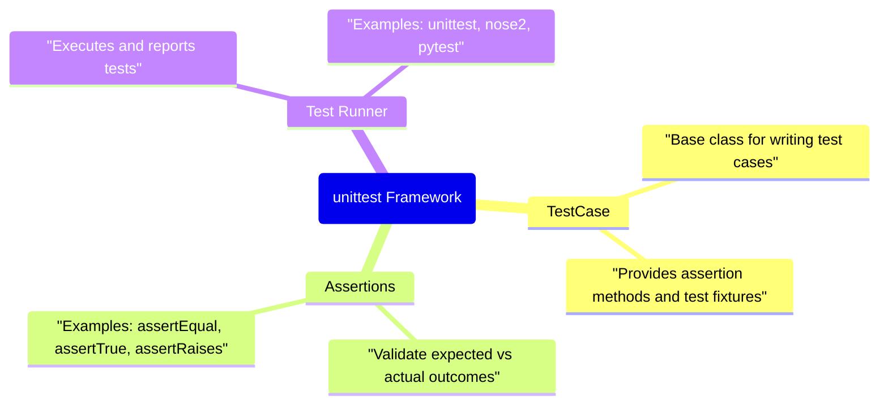
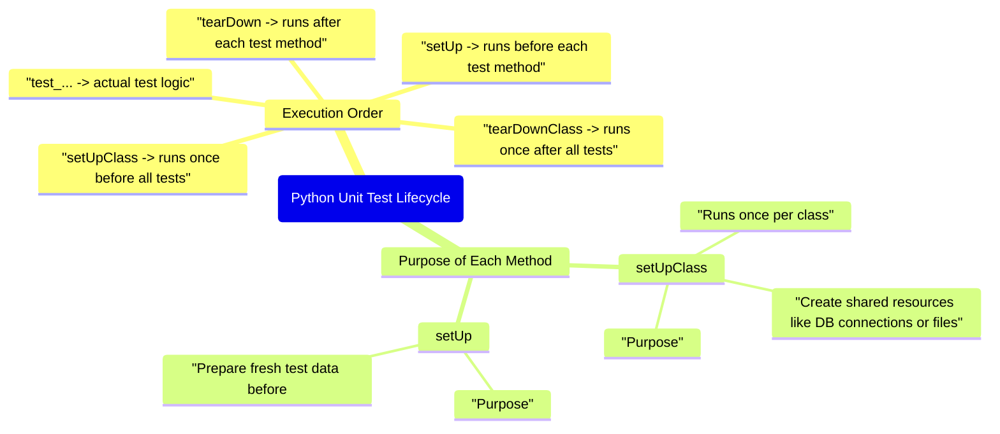
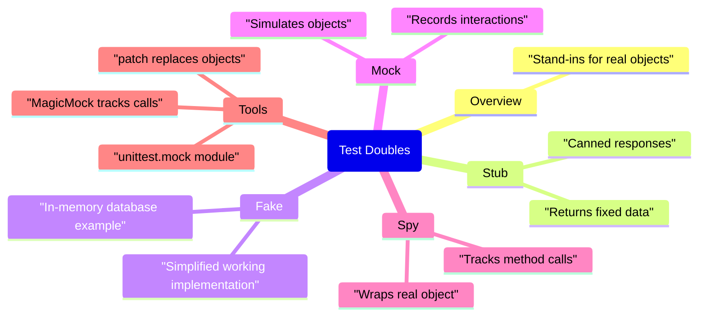
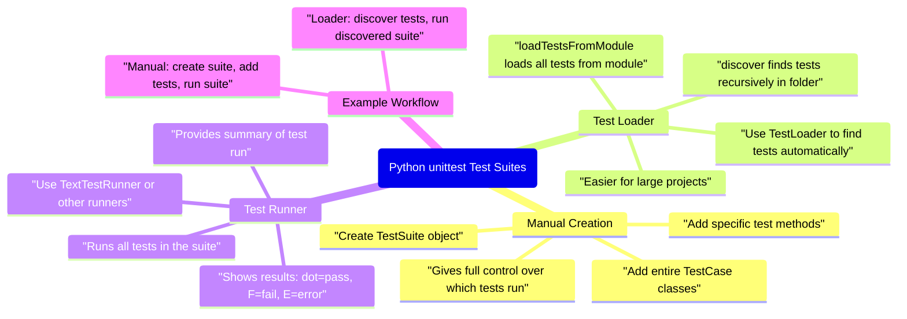
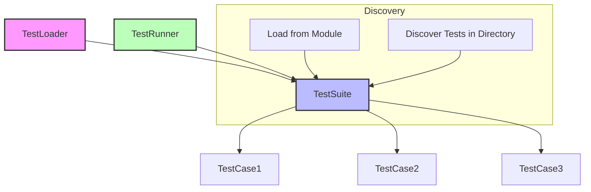

### 1. unittest Framework Basics

---

### 2. Test Lifecycle

### 3. Test Doubles

### 4 Test Design & Results

### 5. Python Unit Test suites

#### What does the above diagram show
1. Root Node
* "Python unittest Test Suites" → This is the central topic. Everything branches out from here.
2. Manual Creation
* Create TestSuite object → You start by creating an empty suite.

* Add specific test methods → You can add individual test methods from TestCase classes.

* Add entire TestCase classes → You can add all tests from a TestCase at once.

* Gives full control over which tests run → You control exactly what runs, useful for small or targeted tests.

3. Test Loader
* Use TestLoader to find tests automatically → Loader automates finding tests.

* loadTestsFromModule loads all tests from module → Automatically adds all tests from a single module.

* discover finds tests recursively in folder → Automatically searches folders for files matching test_*.py and loads all tests.

* Easier for large projects → This saves manual work as your project grows.

4. Test Runner
*  Use TextTestRunner or other runners → Executes the suite.

* Runs all tests in the suite → All tests added to the suite are executed.

* Shows results: dot=pass, F=fail, E=error → The output indicates which tests passed, failed, or errored.

* Provides summary of test run → Shows total tests run, failures, errors, and time taken.

5. Example Workflow
* Manual: create suite, add tests, run suite → Visualizes how manual suites are executed.

* Loader: discover tests, run discovered suite → Visualizes automatic discovery workflow.

### Simple diagram showing how `TestLoader` works with `TestSuite` and `TestRunner` in Python’s unittest framework:

