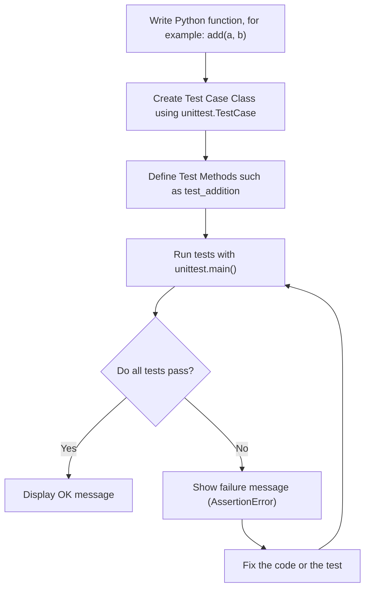

### "Python Programming: Problem Solving, Packages and Libraries" authored by Anurag Gupta and G.P. Biswas
### You can get the book on Amazon [Here](https://amzn.in/d/92pgv9Y)

---

### Unit Test Flow chart

---

