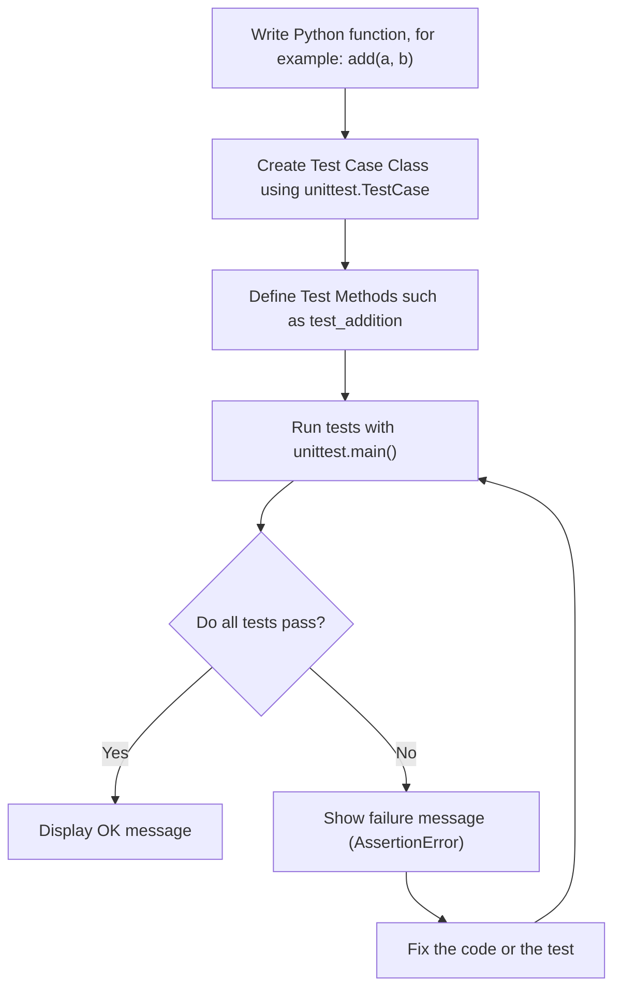
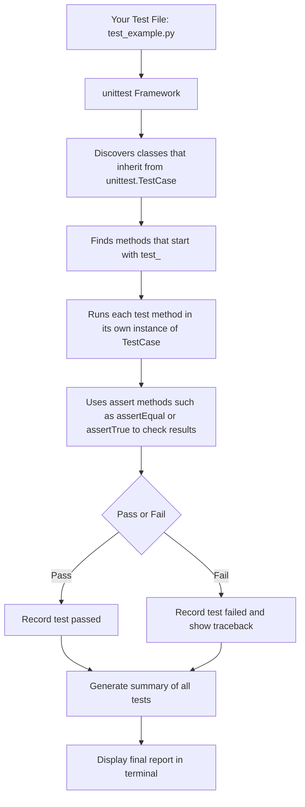

### "Python Programming: Problem Solving, Packages and Libraries" authored by Anurag Gupta and G.P. Biswas
### You can get the book on Amazon [Here](https://amzn.in/d/92pgv9Y)

---

### Unit Test Flow chart

### What the above flow chart shows

1.  You start with a Python function (e.g., `add`).
    
2.  Then you create a test case class using `unittest.TestCase`.
    
3.  Inside it, you define methods that start with `test_`.
    
4.  When you run the tests, Python checks all test cases.
    
5.  If everything passes → you see **“OK”** .
    
6.  If any test fails → you see an **AssertionError**  and can fix the issue.

---

### Diagram explaining `unittest.TestCase`

#### **Explanation of above diagram**

1.  You write your test file (e.g., `test_math.py`).
    
2.  The `unittest` module looks for classes that inherit from `unittest.TestCase`.
    
3.  It scans those classes for methods that start with `test_`.
    
4.  Each test method runs independently — using assertions to check correctness.
    
5.  The framework collects all results (Pass/Fail).
    
6.  Finally, it prints a clear summary in the terminal.

