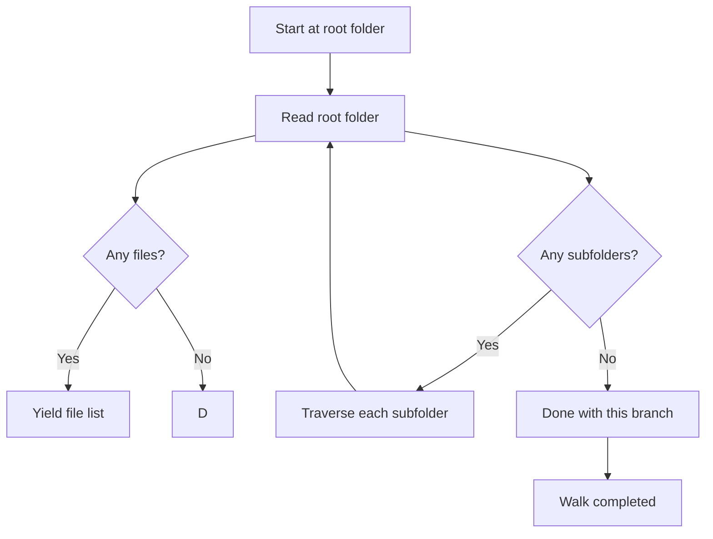
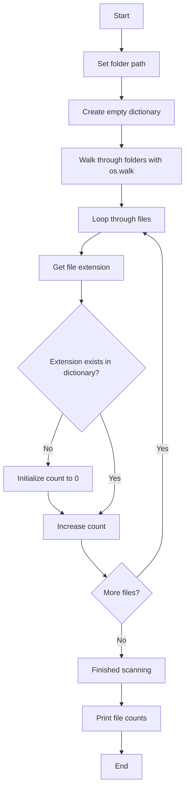
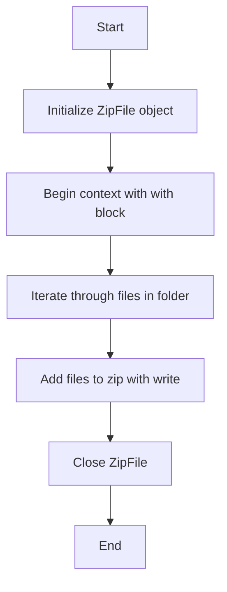

```mermaid

flowchart TD

A[Start at root folder] --> B[Read root folder]
B --> C{Any files?}
C -- Yes --> C1[Yield file list]
C -- No --> D

B --> E{Any subfolders?}
E -- Yes --> E1[Traverse each subfolder]
E1 --> B
E -- No --> F[Done with this branch]

F --> G[Walk completed]

```

### XXX

```mermaid
flowchart TD

A[Start] --> B[Set folder path]
B --> C[Create empty dictionary]
C --> D[Walk through folders with os.walk]
D --> E[Loop through files]
E --> F[Get file extension]
F --> G{Extension exists in dictionary?}

G -- No --> H[Initialize count to 0]
H --> I[Increase count]

G -- Yes --> I[Increase count]

I --> J{More files?}
J -- Yes --> E
J -- No --> K[Finished scanning]

K --> L[Print file counts]
L --> M[End]


```

### Creating a ZIP file with compression (ZIP_DEFLATED)

```mermaid

flowchart TD
    A[Start] --> B[Initialize ZipFile object]
    B --> C[Begin context with with block]
    C --> D[Iterate through files in folder]
    D --> E[Add files to zip with write]
    E --> F[Close ZipFile]
    F --> G[End]


```

