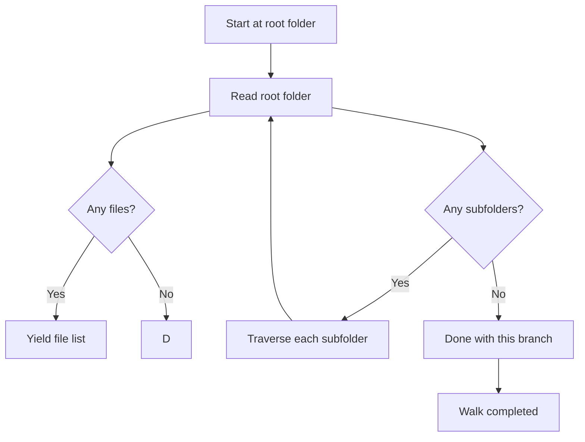

```mermaid

flowchart TD

A[Start at root folder] --> B[Read root folder]
B --> C{Any files?}
C -- Yes --> C1[Yield file list]
C -- No --> D

B --> E{Any subfolders?}
E -- Yes --> E1[Traverse each subfolder]
E1 --> B
E -- No --> F[Done with this branch]

F --> G[Walk completed]


```
